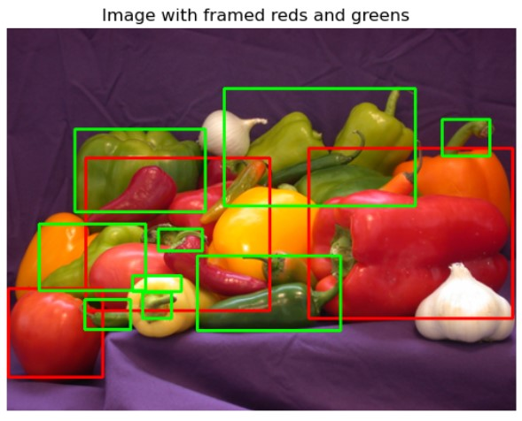

## Colored Image Segmentation with OpenCV

Image segmentation is a fundamental task in computer vision that involves partitioning an image into multiple segments or regions to simplify its representation and facilitate analysis. 
This Python script demonstrates color object detection using OpenCV. The script loads an image, converts it to the RGB color space, and then to the HSV color space. It defines specific ranges for red and green hues in the HSV color space.

## Implementation
- Using these defined ranges, the script creates masks to identify regions of the image that correspond to the specified colors.
- Contours are then found within this combined mask, which helps identify the areas of interest in the image.
- Finally drawing red and green detection rectangles around the identified contours, effectively framing the parts of the image that contain the specified red and green colors.

The resulting image is displayed, showing the original image with red and green rectangles framing the detected red and green regions.

