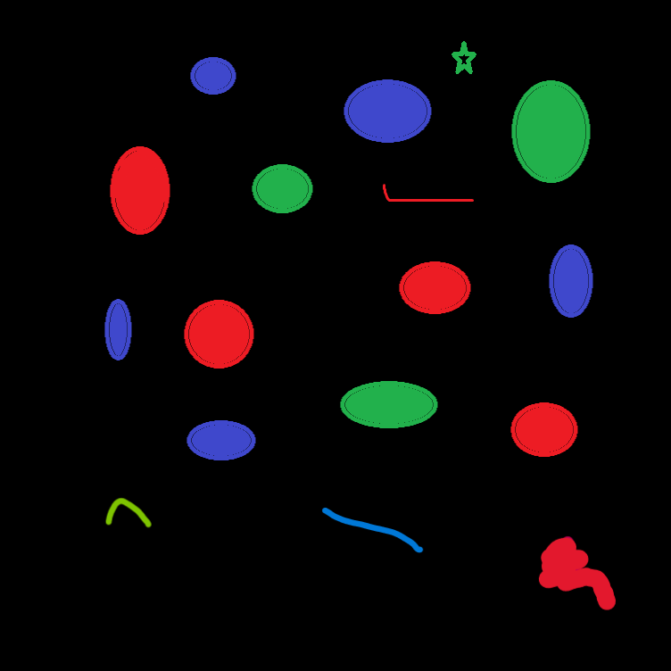
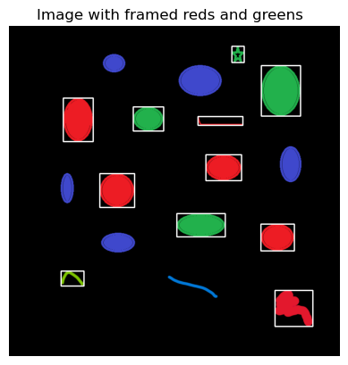

## Color Object Detection with OpenCV

This Python script demonstrates color object detection using OpenCV. The script loads an image, converts it to the RGB color space, and then to the HSV color space. It defines specific ranges for red and green hues in the HSV color space.

- Using these defined ranges, the script creates masks to identify regions of the image that correspond to the specified colors.

- Contours are then found within this combined mask, which helps identify the areas of interest in the image.
- Finally drawing white detection rectangles around the identified contours, effectively framing the parts of the image that contain the specified red and green colors.

The resulting image is displayed, showing the original image with white rectangles framing the detected red and green regions.

